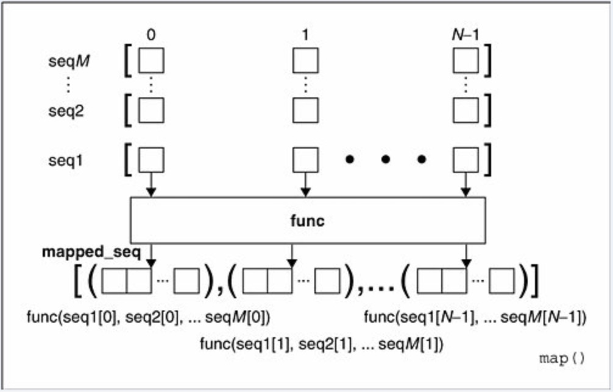

# map函数
-------


## map函数：

> 参数：map() 是python的内置高阶函数，它接收一个 func 和一个 iterable 。

>  参数作用：函数 func 依次作用在 iterable 的每个元素上，得到一个新的 list 并返回。

> 输出结果：python2直接输出map转换后的新 iterable 值，python3则返回一个<font color=red face="微软雅黑">迭代器</font>，如果需要list格式，直接<font color=red face="微软雅黑"> list(map()) </font>转换。

- - -

**<font color=indianred face="微软雅黑">1.当seq只有一个时，将函数func作用在seq的每个元素上，并得到一个新的seq.</font>**
<br/>

<br/>

例1：
> 利用map函数将l中每个元素都平方：

```python
l1 = [1, 2, 3, 4, 5, 6, 7, 8, 9]


def square(x):
    return x**2

print('map:', map(square, l1))
print('list(map)', list(map(square, l1)))
```
输出结果为：

```python
#迭代器
map:<map object at 0x101f682e8>
list(map):[1, 4, 9, 16, 25, 36, 49, 64, 81]
```


<font color=red face="微软雅黑">注意1：
map()函数不改变原有的list，而是返回一个新的 list。</font>
> 利用map()函数，可以把一个 list 转换为另一个 list，只需要传入转换函数。

> 由于list包含的元素可以是任何类型，因此，map() 不仅仅可以处理只包含数值的 list，事实上它可以处理包含任意类型的 list，只要传入的函数f可以处理这种数据类型。

<br/>
例2：

> 假设用户输入的英文名字不规范，没有按照首字母大写，后续字母小写的规则，请利用map()函数，把一个list（包含若干不规范的英文名字）变成一个包含规范英文名字的list：

```python
l2 = ['adam', 'LISA', 'barT']

def format_name(s):
    s1=s[0:1].upper()+s[1:].lower();
    return s1;


print(map(format_name, l2))
print(list(map(format_name, l2)))
```

输出结果

```python
<map object at 0x103bafe48>
['Adam', 'Lisa', 'Bart']
```

其中func函数也可以用lambda函数来代替，这样例1例2的解法代码更简洁，但牺牲了阅读性：

例1另解：
```python
map(lambda x:x**2,l1)
```


例2另解：

```python
map(lambda x:x[0].upper+x[1:].lower(),l2)
```

* * *

**<font color=indianred face="微软雅黑">2、当seq多于一个时，map可以并行（注意是并行）地对每个seq执行如下图所示的过程：</font>**
<br/>

<br/>

例3：
> 将列表l3和l4中的元素分别相乘，返回新的值列表

```python
l3 = [1, 2, 3]
l4 = [4, 5, 6]
result = map(lambda x, y: x*y, l3, l4)
print('result:', result)
print('result_list:', list(result))
```

输出结果：
```python
result: <map object at 0x101f682b0>
result_list: [4, 10, 18]
```

<font color=red face="微软雅黑">注意：python3中可以处理列表长度不一致的情况(位置相同的元素会进行处理，其余的元素不处理)，但无法处理类型不一致的情况.</font>

例4：

```python
l5 = [1, 2, 3]
l6 = [1, 2]
result = map(lambda x, y: (x**y, x+y), l5, l6)
print('result:', result)
print('result_list:', list(result))
```

输出结果：

```python
result: <map object at 0x104fa24e0>
result_list: [(1, 2), (4, 4)]
```

例5：
```python
l7 = [1, 2, 3]
l8 = [1, 2, 'a']
result = map(lambda x, y: (x**y, x+y), l7, l8)
print('result:', result)
print('result_list:', list(result))
```

输出结果：
```python
TypeError: unsupported operand type(s) for ** or pow(): 'int' and 'str'
```

* * *

**<font color=indianred face='微软雅黑'>3、特殊用法：类型转换，将可迭代的内容中按照 func 每个元素转换成相应的数据类型</font>**

例6：
```python
result = map(int, '1234')
print('result:        ', result)
print('result_list:   ', list(result))
```
输出结果：
```python
result:         <map object at 0x101f682e8>
result_list:    [1, 2, 3, 4]
```

<font color=red face='微软雅黑'> 注意2：
在 python2 中，如果函数是 None，自动假定一个 ‘identity’函数,这时候 map 相当于 zip()函数；</font>

<font color=red face='微软雅黑'>在 python3 中，因为 python3 中 map函数 返回是一个迭代器，None类型不是一个可以调用的对象，所以不可用</font>

**例7：**
> 在python2中：

```python
print map(None, [2,4,6],[3,2,1])
```

输出结果：
```python
[(2, 3), (4, 2), (6, 1)]
```

**例8：**
> 在python3中：

```python
print(map(None, [2,4,6],[3,2,1]))
```

输出结果：
```python
TypeError: 'NoneType' object is not callable test
```
