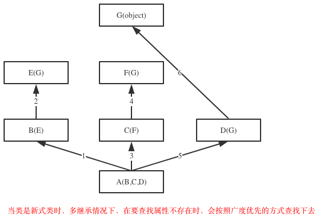

### 继承实现原理

python到底是如何实现继承的，对于你定义的每一个类，python会计算出一个方法解析顺序(MRO)列表，这个MRO列表就是一个简单的所有基类的线性顺序列表。


##### 举个例子:

```python
class A:
    def func(self):
        print("from A")
class B(A):
    def func(self):
        print("from B")
class C(B):
    def func(self):
        print("from C")
class D(C):
    def func(self):
        print("from A")
class E(D):
    def func(self):
        print("from E")
class F(E):
    def func(self):
        print("from F")
class G(F):
    def func(self):
        print("from G")
```

查看mro表:

```python
G.mro()
```

输出结果为:

```python
[<class '__main__.G'>, <class '__main__.F'>, <class '__main__.E'>, <class '__main__.D'>, <class '__main__.C'>, <class '__main__.B'>, <class '__main__.A'>, <class 'object'>]
```

##### MRO原理介绍

为了实现继承,python会在MRO列表上从左到右开始查找基类,直到找到第一个匹配这个属性的类为止。而这个MRO列表的构造是通过一个C3线性化算法来实现的。

我们不去深究这个算法的数学原理,它实际上就是合并所有父类的MRO列表并遵循如下三条准则:

* 1.子类会先于父类被检查
* 2.多个父类会根据它们在列表中的顺序被检查
* 3.如果对下一个类存在两个合法的选择,选择第一个父类


在Java和C#中子类只能继承一个父类，而Python中子类可以同时继承多个父类。

如果继承了多个父类，那么属性的查找方式有两种，分别是：深度优先和广度优先

* 深度优先

当类是经典类时，多继承情况下，在要查找属性不存在时，会按照深度优先的方法查找。


* 广度优先

当类是新式类，多继承的情况下，当要查找属性不存在时，会按照广度优先的方式查找。




##### 补充知识点:经典类与新式类

1.只有在python2中才分新式类和经典类，python3中统一都是新式类

2.在python2中，没有显式的继承object类的类，以及该类的子类，都是经典类

3.在python2中，显式地声明继承object的类，以及该类的子类，都是新式类

4.在python3中，无论是否继承object，都默认继承object，即python3中所有类均为新式类
