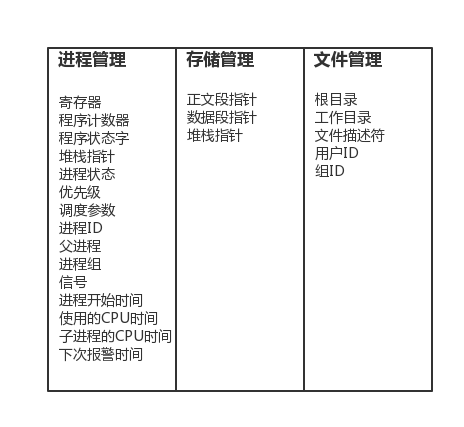

## 进程理论

### 一、什么是进程

进程：正在进行的一个过程或者说一个任务。而负责执行任务则是cpu。

### 二、进程与程序的区别

程序仅仅只是一堆代码而已，而进程指的是程序的运行过程。

---

注意:

同一个程序执行两次，那也是两个进程，比如打开暴风影音，虽然都是同一个软件，但是一个可以播放小猪佩奇，一个可以播放葫芦娃。

---

### 三、并发与并行

无论是并行还是并发，在用户看来都是'同时'运行的，不管是进程还是线程，都只是一个任务而已，真是干活的是cpu，cpu来做这些任务，而一个cpu同一时刻只能执行一个任务

* 并发

伪并行，即看起来是同时运行。单个cpu+多道技术就可以实现并发。(单核+多道，实现多个进程的并发执行)

* 并行

同时运行，只有具备多个cpu才能实现并行。单核下，可以利用多道技术，多个核，每个核也都可以利用多道技术（多道技术是针对单核而言的）

### 四、进程的创建

但凡是硬件，都需要有操作系统去管理，只要有操作系统，就有进程的概念，就需要有创建进程的方式，一些操作系统只为一个应用程序设计，比如微波炉中的控制器，一旦启动微波炉，所有的进程都已经存在。

而对于通用系统（跑很多应用程序），需要有系统运行过程中创建或撤销进程的能力，主要分为4中形式创建新的进程:

* 系统初始化

（查看进程linux中用ps命令，windows中用任务管理器，前台进程负责与用户交互，后台运行的进程与用户无关，运行在后台并且只在需要时才唤醒的进程，称为守护进程，如电子邮件、web页面、新闻、打印）

* 开启子进程

一个进程在运行过程中开启了子进程（如nginx开启多进程，os.fork,subprocess.Popen等）

* 用户的交互式请求

用户的交互式请求，而创建一个新进程（如用户双击暴风影音）

* 批作业的初始化

一个批处理作业的初始化（只在大型机的批处理系统中应用）

无论哪一种，新进程的创建都是由一个已经存在的进程执行了一个用于创建进程的系统调用而创建的：

1.相同的是：进程创建后，父进程和子进程有各自不同的地址空间（多道技术要求物理层面实现进程之间内存的隔离），任何一个进程的在其地址空间中的修改都不会影响到另外一个进程。

2.不同的是：在UNIX中，子进程的初始地址空间是父进程的一个副本，提示：子进程和父进程是可以有只读的共享内存区的。但是对于windows系统来说，从一开始父进程与子进程的地址空间就是不同的。

### 六、进程的终止

1.正常退出（自愿，如用户点击交互式页面的叉号，或程序执行完毕调用发起系统调用正常退出，在linux中用exit，在windows中用ExitProcess）

2.出错退出（自愿，python a.py中a.py不存在）

3。严重错误（非自愿，执行非法指令，如引用不存在的内存，1/0等，可以捕捉异常，try...except...）

4.被其他进程杀死（非自愿，如kill -9）

### 七、进程的层次结构

无论UNIX还是windows，进程只有一个父进程，不同的是：

1、在UNIX中所有的进程，都是以init进程为根，组成树形结构。父子进程共同组成一个进程组，这样，当从键盘发出一个信号时，该信号被送给当前与键盘相关的进程组中的所有成员。

2、在windows中，没有进程层次的概念，所有的进程都是地位相同的，唯一类似于进程层次的暗示，是在创建进程时，父进程得到一个特别的令牌（称为句柄）,该句柄可以用来控制子进程，但是父进程有权把该句柄传给其他子进程，这样就没有层次了。

### 八、进程的状态

tail -f access.log |grep '404'

执行程序tail，开启一个子进程，执行程序grep，开启另外一个子进程，两个进程之间基于管道'|'通讯，将tail的结果作为grep的输入。

进程grep在等待输入（即I/O）时的状态称为阻塞，此时grep命令都无法运行

其实在两种情况下会导致一个进程在逻辑上不能运行，

1.进程挂起是自身原因，遇到I/O阻塞，便要让出CPU让其他进程去执行，这样保证CPU一直在工作

2.与进程无关，是操作系统层面，可能会因为一个进程占用时间过多，或者优先级等原因，而调用其他的进程去使用CPU。

因而一个进程由三种状态

### 九、进程并发的实现

进程并发的实现在于，硬件中断一个正在运行的进程，把此时进程运行的所有状态保存下来，为此，操作系统维护一张表格，即进程表（process table），每个进程占用一个进程表项（这些表项也称为进程控制块）

该表存放了进程状态的重要信息：程序计数器、堆栈指针、内存分配状况、所有打开文件的状态、帐号和调度信息，以及其他在进程由运行态转为就绪态或阻塞态时，必须保存的信息，从而保证该进程在再次启动时，就像从未被中断过一样。
